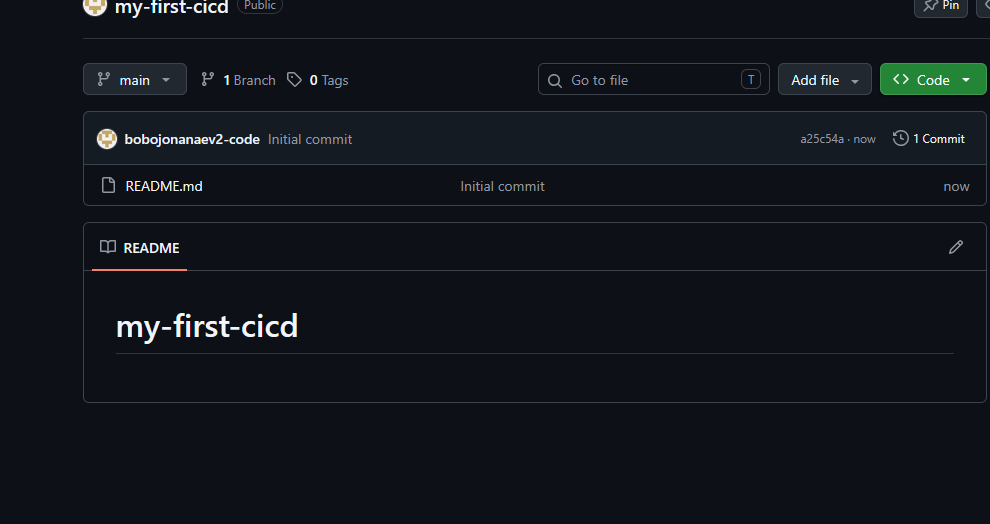
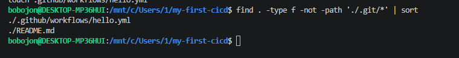
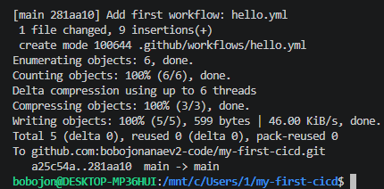
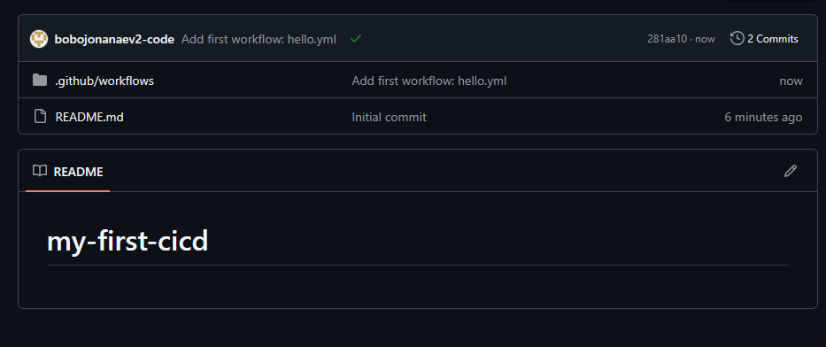
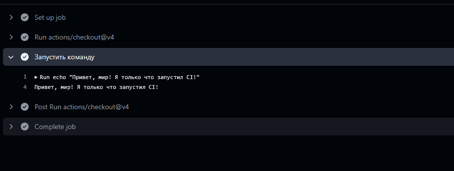

# 01. Первый Pipeline на CI в GitHub Actions

Простейший workflow GitHub Actions: выводит приветствие при каждом push.

## Задание

Источник: [content/DevOps/CI_CD/Pipelines/hello.md](https://gitflic.ru/project/rurewa/mfua/blob?file=content/DevOps/CI_CD/Pipelines/hello.md&branch=master)
Отдельный репозиторий: [bobojonanaev2-code/my-first-cicd](https://github.com/bobojonanaev2-code/my-first-cicd)

## Что сделано

- Создан публичный репозиторий `my-first-cicd` на GitHub
- Склонирован в WSL
- Создана структура `.github/workflows/hello.yml`
- Workflow запускается при каждом push
- Проверено выполнение: зелёная галочка в разделе Actions

## Структура проекта

```
my-first-cicd/
├── .github/
│   └── workflows/
│       └── hello.yml
└── README.md
```

## Содержимое `.github/workflows/hello.yml`

```yaml
name: Мой первый workflow
on: [push]
jobs:
  build:
    runs-on: ubuntu-latest
    steps:
      - uses: actions/checkout@v4
      - name: Запустить команду
        run: echo "Привет, мир! Я только что запустил CI!"
```

## Команды

```bash
git clone git@github.com:bobojonanaev2-code/my-first-cicd.git
cd my-first-cicd
mkdir -p .github/workflows
touch .github/workflows/hello.yml
git add .
git commit -m "Add first workflow"
git push origin main
```

## Результат

- Actions: https://github.com/bobojonanaev2-code/my-first-cicd/actions
- Статус: ✅ все шаги прошли успешно

## Скриншоты

### 1. Push в репозиторий


### 2. Список workflow в Actions


### 3. Детали запуска


### 4. Шаги выполнения


### 5. Вывод команды


### 6. Репозиторий на GitHub
