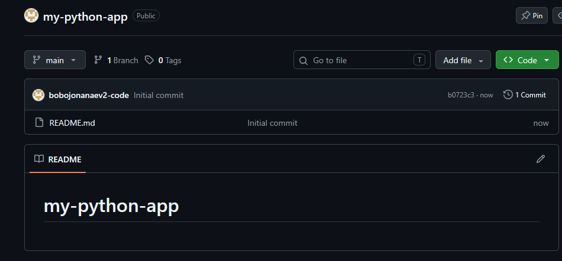
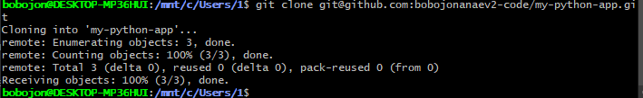
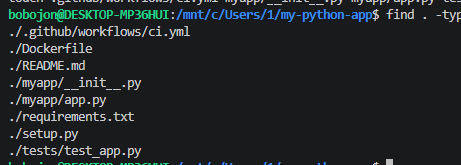
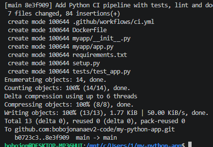
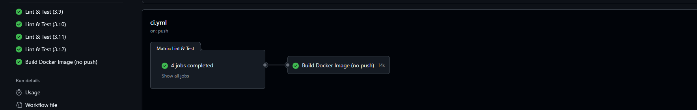
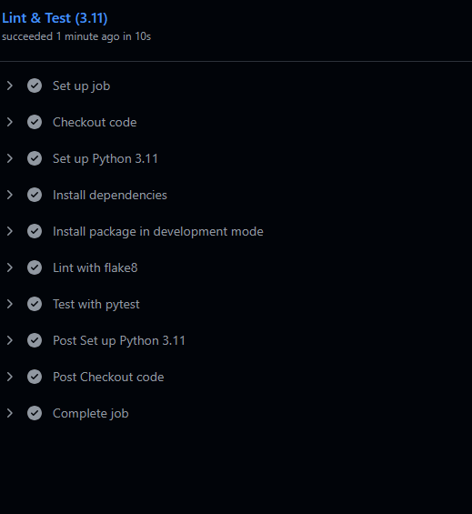
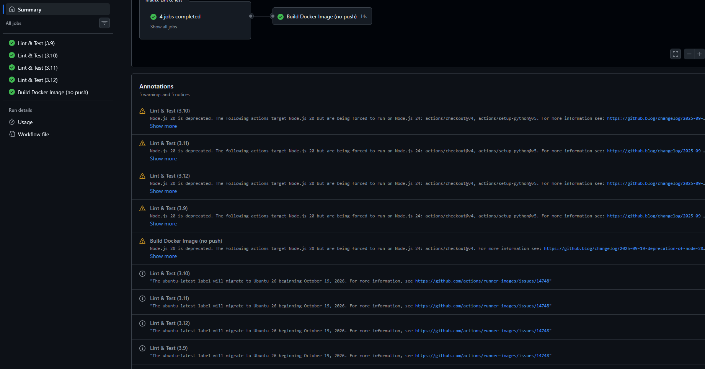
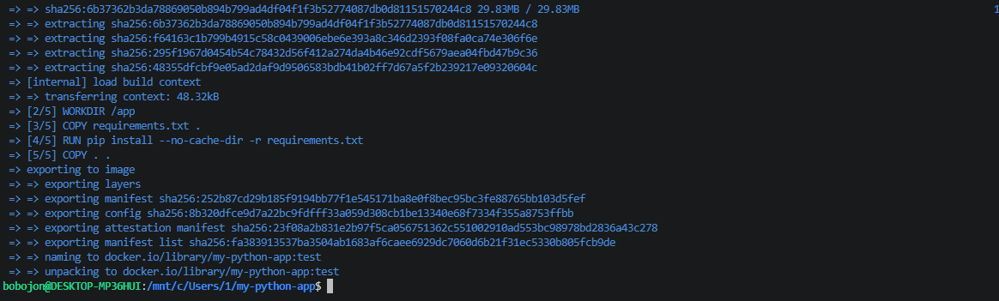
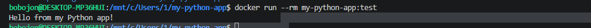

## Скриншоты

### 1. Push

### 2. Список workflow в Actions

### 3. Jobs (матрица Python + Docker)

### 4. Вывод pytest

### 5. Локальная сборка Docker-образа

### 6. Запуск контейнера

### 7. Вывод контейнера

### 8. Дополнительно

### 9. Дополнительно
