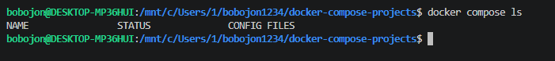
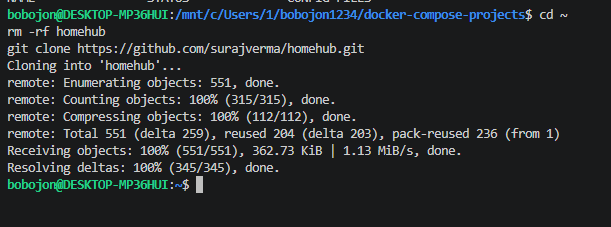
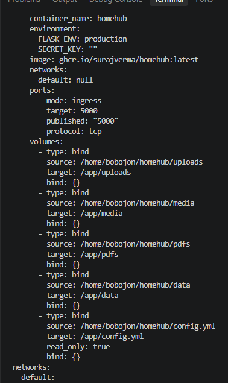
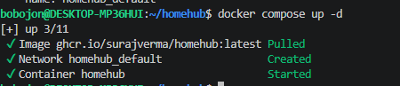
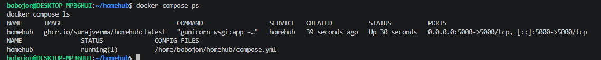
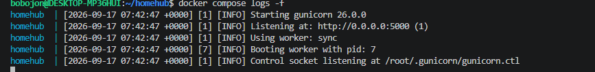
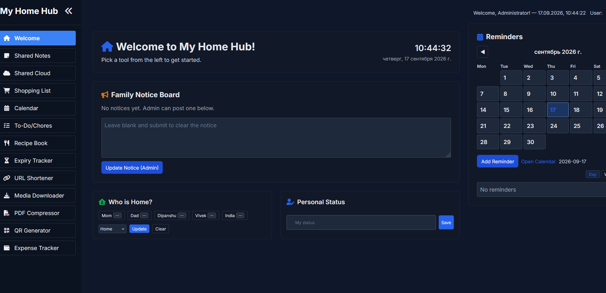
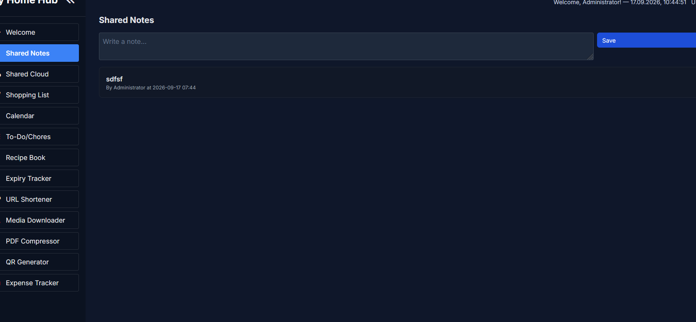

# 08. HomeHub

Развёртывание семейной панели управления HomeHub из upstream-репозитория.

## Задание

Источник: [content/Docker/DockerCompose/Homehub.md](https://gitflic.ru/project/rurewa/mfua/blob?file=content/Docker/DockerCompose/Homehub.md&branch=master)
Upstream: [github.com/surajverma/homehub](https://github.com/surajverma/homehub)

## Что сделано

- Клонирован репозиторий HomeHub: `git clone https://github.com/surajverma/homehub.git`
- Создан `config.yml` — конфигурация с настройками интерфейса, списком членов семьи, категориями напоминаний, темой
- Заменён `compose.yml` — сервис **homehub** с портом `5000:5000` и bind-mount для `config.yml` и папок `uploads/media/pdfs/data`
- Проект запущен: `docker compose up -d`
- Открыт веб-интерфейс по адресу http://localhost:5000
- Проверена работа одной из функций (плитки)

## Команды

```bash
cd ~
git clone https://github.com/surajverma/homehub.git
cd homehub
touch config.yml
docker compose up -d
docker compose ps
docker compose logs -f
docker compose down -v
docker compose down --rmi all -v
```

## Доступ

- HomeHub UI: http://localhost:5000
- Пароль: пустой (password-less режим)

## Скриншоты

### 1. Проверка активных проектов


### 2. Клонирование репозитория


### 3. Конфигурация


### 4. Запуск проекта


### 5. Статус контейнера


### 6. Логи


### 7. Дашборд HomeHub


### 8. Функция в работе
