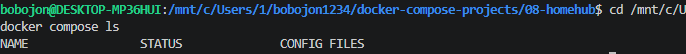
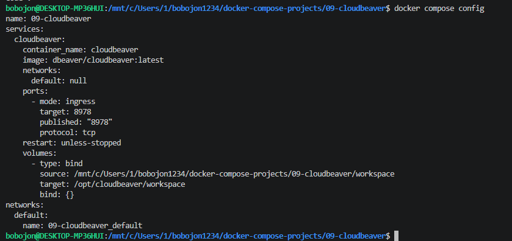
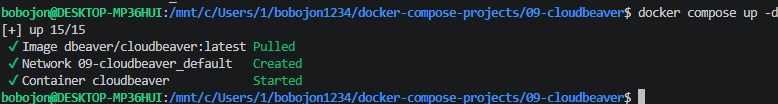
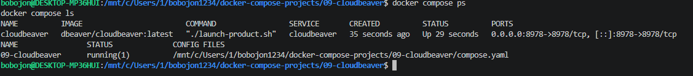
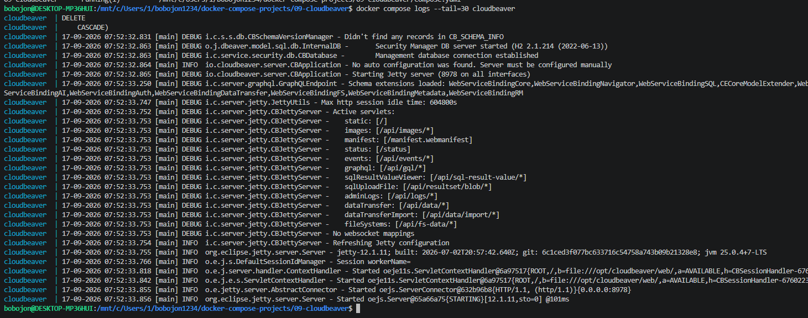
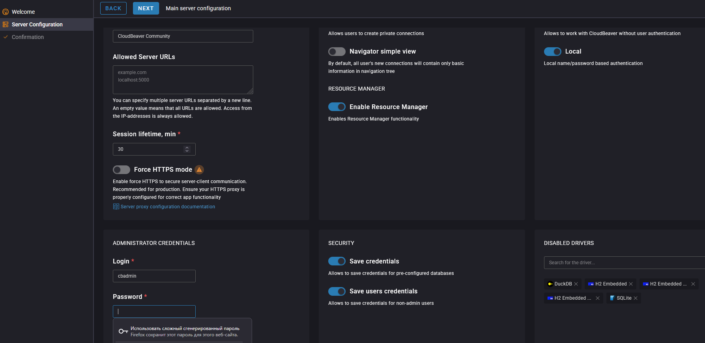
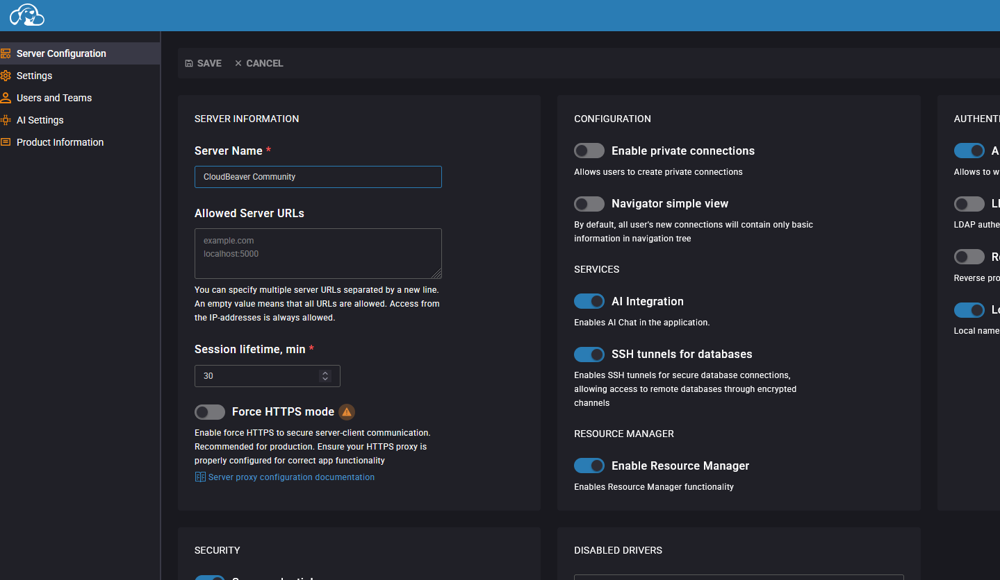
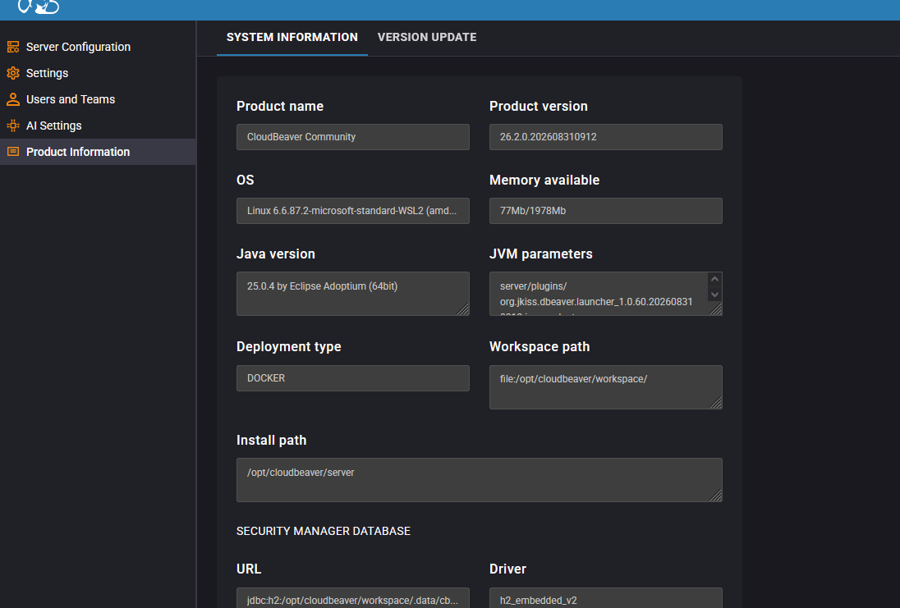

# 09. CloudBeaver

Развёртывание веб-версии DBeaver — CloudBeaver — через Docker Compose.

## Задание

Источник: [content/Docker/DockerCompose/CloudBeaver.md](https://gitflic.ru/project/rurewa/mfua/blob?file=content/Docker/DockerCompose/CloudBeaver.md&branch=master)

## Что сделано

- Создан `compose.yaml` с сервисом **cloudbeaver**:
  - Образ `dbeaver/cloudbeaver:latest`
  - Container name `cloudbeaver`
  - Порт `8978:8978`
  - Volume `./workspace` → `/opt/cloudbeaver/workspace`
- Проект запущен: `docker compose up -d`
- Выполнен вход в веб-интерфейс по адресу http://localhost:8978
- Создан администратор `cbadmin`
- Проверено создание тестового подключения к базе данных

## Команды

```bash
docker compose ls
docker compose up -d
docker compose ps -a
docker compose logs cloudbeaver
docker compose logs -f cloudbeaver
docker compose config
docker compose stop
docker compose start
docker compose restart
docker compose down
docker compose down -v
docker image rm dbeaver/cloudbeaver:latest
```

## Доступ

- CloudBeaver UI: http://localhost:8978
- Логин администратора: `cbadmin`

## Скриншоты

### 1. Проверка активных проектов


### 2. Конфигурация


### 3. Запуск проекта


### 4. Статус контейнера


### 5. Логи


### 6. Создание администратора


### 7. Дашборд CloudBeaver


### 8. Тестовое подключение к БД
